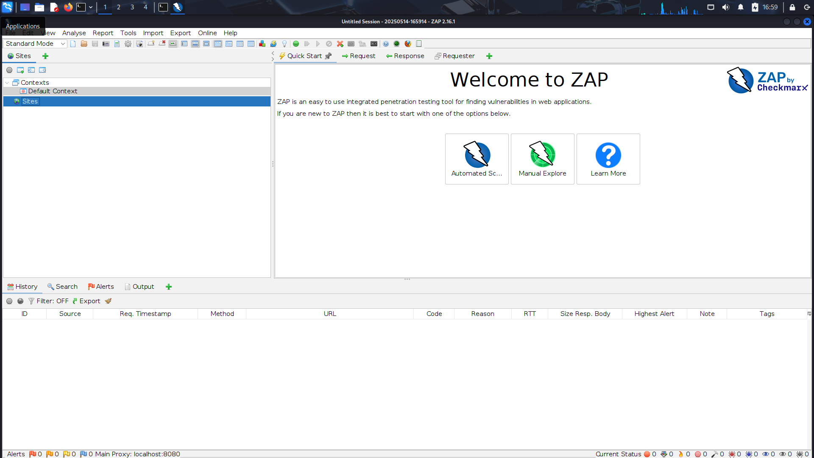
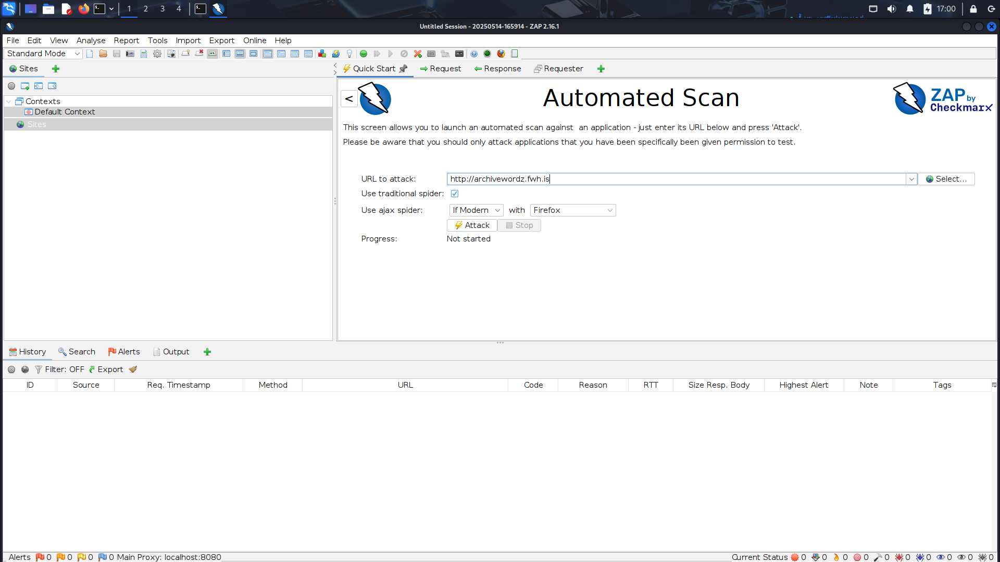
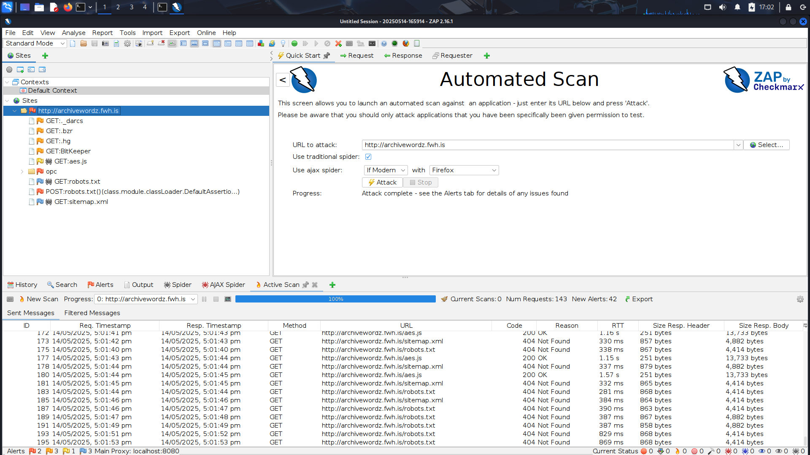

# ZAP Proxy (OWASP ZAP) Installation and Usage Guide  follow my github :)

## Installation

1. Visit the official OWASP ZAP download page: [https://www.zaproxy.org/download/](https://www.zaproxy.org/download/)
2. Download the appropriate version for your operating system (Windows/Linux/macOS)
3. Run the installer and follow the installation wizard
4. Launch ZAP after installation

Here's how the main interface looks after installation:

## Getting Started

1. When you first open ZAP, you'll see the main dashboard
2. Configure your browser to use ZAP as a proxy:
   - Default proxy settings: `127.0.0.1:8080`
   - You can install the ZAP certificate to handle HTTPS traffic

## Basic Usage

To start testing a website:

1. Enter the target URL in the Quick Start tab
2. Click on "Attack" to begin automated scanning
3. ZAP will spider the website and perform active scanning

## Saving and Managing Results

After completing your security testing:

1. All results are automatically saved in the Sites tree
2. You can generate reports in various formats (HTML, XML, JSON, PDF)
3. Results are stored in your specified directory

## Additional Resources

- [Official OWASP ZAP Documentation](https://www.zaproxy.org/docs/)
- [OWASP ZAP User Guide](https://www.zaproxy.org/docs/desktop/ui/)
- [ZAP API Documentation](https://www.zaproxy.org/docs/api/)

## License

This documentation is provided under the MIT License. OWASP ZAP is licensed under Apache License 2.0. 
